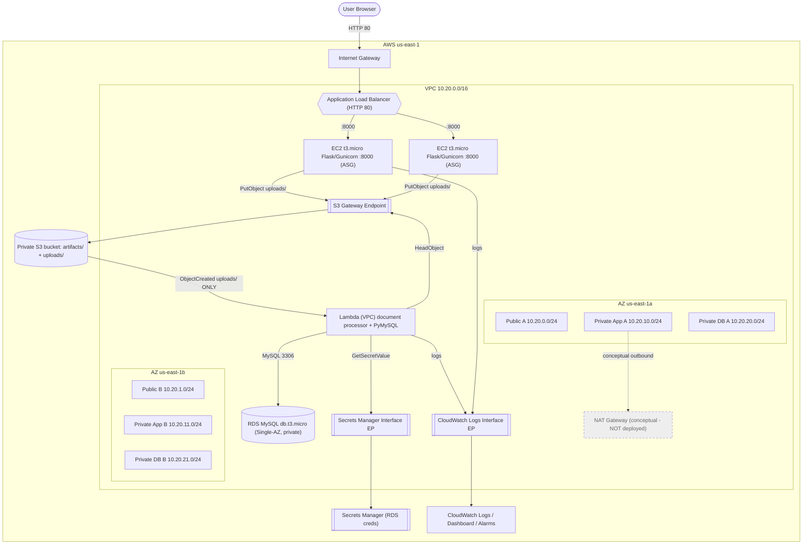

# ARCHITECTURE — NAGP AWS Insurance Document-Upload MVP

> **Status: DESIGN FROZEN (design only).** No AWS resources exist yet. All values below
> were validated read-only against `us-east-1` with the AWS CLI. Region: **us-east-1**.

## 1. Region & Availability Zones
- Region: **us-east-1**.
- Selected AZs: **us-east-1a** (`use1-az1`) and **us-east-1b** (`use1-az2`).
- Rationale: both AZs offer **t3.micro** and **db.t3.micro**, and all three required VPC
  endpoint services (validated read-only). AZ selection is frozen; do not change.

## 2. VPC & subnet layout (validated non-overlapping)
VPC CIDR: **10.20.0.0/16** (65,536 addresses).

| Subnet | CIDR | AZ | Tier | Public IP | Usable IPs |
|--------|------|----|------|-----------|-----------|
| Public A            | 10.20.0.0/24  | us-east-1a | Public (ALB, temp builder) | Builder only | 251 |
| Public B            | 10.20.1.0/24  | us-east-1b | Public (ALB)               | No | 251 |
| Private App A       | 10.20.10.0/24 | us-east-1a | App (EC2 ASG + Lambda ENIs)| No | 251 |
| Private App B       | 10.20.11.0/24 | us-east-1b | App (EC2 ASG + Lambda ENIs)| No | 251 |
| Private DB A        | 10.20.20.0/24 | us-east-1a | Database (RDS)             | No | 251 |
| Private DB B        | 10.20.21.0/24 | us-east-1b | Database (Multi-AZ-ready)  | No | 251 |

All six /24 blocks are inside 10.20.0.0/16, distinct third octets (0,1,10,11,20,21),
**no overlaps**. AWS reserves 5 IPs/subnet, leaving 251 usable each.

## 3. Routing
| Route table | Associations | Routes |
|-------------|--------------|--------|
| **Public RT**   | Public A, Public B | `10.20.0.0/16`→local; `0.0.0.0/0`→**IGW**; S3 prefix-list→**S3 Gateway Endpoint** |
| **Private App RT** | Private App A, Private App B | `10.20.0.0/16`→local; **no** `0.0.0.0/0`; S3 prefix-list→**S3 Gateway Endpoint** |
| **Private DB RT** | Private DB A, Private DB B | `10.20.0.0/16`→local only (no internet, no S3 route) |

- **Internet Gateway (IGW):** attached to the VPC; used by the ALB (ingress) and by the
  temporary AMI builder (egress for package installs).
- **S3 Gateway Endpoint:** adds an S3 prefix-list route to the Public and Private App
  route tables so EC2 (upload + artifact fetch) and Lambda (read) reach S3 privately.
- **NAT Gateway:** **NOT deployed** (cost). Shown conceptually as the production path for
  private-subnet outbound internet. Not required here because all private-subnet AWS
  access is served by VPC endpoints and all OS/app software is baked into the custom AMI.

## 4. Interface (PrivateLink) endpoints
Interface endpoints created in **Private App A + B** (one ENI per selected app AZ),
private DNS enabled:
- `com.amazonaws.us-east-1.secretsmanager` → `secretsmanager.us-east-1.amazonaws.com`
- `com.amazonaws.us-east-1.logs` → `logs.us-east-1.amazonaws.com`

Gateway endpoint (route-based, no hourly charge):
- `com.amazonaws.us-east-1.s3` (Gateway type).

All three validated available in both selected AZs.

## 5. How EC2 works WITHOUT NAT (key design point)
Final EC2 app instances live in the **private app subnets with no public IP and no NAT
route**. They still function because:
1. **Inbound** app traffic arrives only from the ALB via intra-VPC (local) routing.
2. **Outbound to S3** (`PutObject uploads/`) uses the **S3 Gateway Endpoint**.
3. **Outbound to CloudWatch Logs** uses the **Logs Interface Endpoint** (443).
4. **All OS packages, Python, Flask, Gunicorn, boto3, and the app** are pre-installed in
   the **custom AMI** (built once in a public subnet, §7), so runtime instances never
   need `dnf`/`pip` internet access.
5. EC2 does **not** talk to the database (only Lambda does), so no DB egress.

The only component that needs general internet egress is the **temporary AMI builder**,
which lives briefly in a public subnet with an IGW route and is terminated before the
runtime ASG is created.

## 6. S3 layout, end-to-end flow & data model
### 6.1 Private S3 bucket layout (explicit)
```
s3://<project-bucket>/
  artifacts/app/      # packaged Flask app artifact (builder reads this)
  artifacts/lambda/   # packaged Lambda deployment zip (deploy-time source)
  uploads/            # user-uploaded documents  ← ONLY prefix that triggers Lambda
```
**S3 ObjectCreated notification is configured ONLY for the `uploads/` prefix.** Writes to
`artifacts/*` never invoke the Lambda.

### 6.2 Flow
```
Browser ──HTTP:80──▶ ALB (public subnets, internet-facing)
                      │  forwards :8000
                      ▼
               Flask on EC2 (Gunicorn, private app subnets, ASG)
                      │  boto3 PutObject → uploads/<file>
                      ▼
        Private S3 bucket (Block Public Access, SSE, uploads/ prefix)
                      │  s3:ObjectCreated (prefix uploads/ ONLY)
                      ▼
            Python Lambda (VPC-attached, private app subnets; PyMySQL)
              ├─ S3 HeadObject → content type / metadata
              ├─ Secrets Manager GetSecretValue → DB creds  (Interface Endpoint)
              ├─ connect to RDS MySQL (private DB subnets)   (only Lambda may)
              ├─ CREATE TABLE IF NOT EXISTS document_uploads
              └─ INSERT (file_name, content_type, upload_timestamp, ...)
                      │
                      ▼
             CloudWatch Logs (Logs Interface Endpoint)
```

### 6.3 Metadata table schema (MySQL)
```sql
CREATE TABLE IF NOT EXISTS document_uploads (
  id               BIGINT        NOT NULL AUTO_INCREMENT,
  file_name        VARCHAR(1024) NOT NULL,   -- required business field
  content_type     VARCHAR(255)  NOT NULL,   -- required business field
  upload_timestamp DATETIME      NOT NULL,   -- required business field (S3 object time)
  s3_object_key    VARCHAR(1024) NOT NULL,   -- useful: exact object key
  created_at       TIMESTAMP     NOT NULL DEFAULT CURRENT_TIMESTAMP,
  PRIMARY KEY (id)
);
```
The three assignment-required business fields (**file name, content type, upload
timestamp**) are present; `s3_object_key`/`created_at` add traceability.

### 6.4 Controlled read/demo path
Lambda also accepts a manual event, e.g. `{"action":"read_recent","limit":10}`, which
runs `SELECT ... ORDER BY id DESC LIMIT n` **inside the VPC-attached Lambda** and returns
rows as demo evidence — proving the RDS write **without exposing the database to EC2 or
the local machine**.

## 7. EC2 / custom AMI build (NAT-free deployment)
1. Launch a **temporary builder** (**t3.micro**, CPU credits = **standard**) in **Public
   A** with a public IP + IGW.
2. **User-data bootstrap:** install the **Python 3.11** runtime (`python3.11`,
   `python3.11-pip`) — the pinned dependencies require Python ≥ 3.10, and the AL2023
   system `python3` (3.9) is left untouched; retrieve the packaged app from
   **`s3://<bucket>/artifacts/app/`** (via the S3 gateway endpoint / AWS CLI); build a
   Python 3.11 venv and `pip install` the pinned `flask`/`gunicorn`/`boto3`. **PyMySQL is
   NOT installed on EC2** — it belongs only to the Lambda package. Create a `systemd`
   unit running Gunicorn from the venv on `:8000` with a `/health` endpoint.
3. **Signal completion** via a non-secret status mechanism (e.g., write a small
   `build-complete` marker to S3 / an instance tag), then **create the AMI**.
4. **Verify AMI available**, then **terminate the builder**.
5. **ASG** launches from the custom AMI into **Private App A/B** — no internet needed.
6. AMI + its EBS snapshot are cleaned up during teardown.

**No GitHub token, no SSH, no credentials in user-data.** The builder reads the app
artifact from private S3 using its instance-role permissions (`s3:GetObject` on
`artifacts/app/*` only).

**Runtime configuration without rebuilding the AMI:** non-secret values (bucket name,
region, app port) are supplied to final instances at launch via the **Launch Template
user-data / instance tags / SSM Parameter Store (non-secret)** — never baked into the
image. Secrets are never placed on EC2; only the Lambda fetches DB credentials at
runtime from Secrets Manager.

Base AMI discovery: AWS-owned SSM public parameter
`/aws/service/ami-amazon-linux-latest/al2023-ami-kernel-default-x86_64`
(resolved read-only to `ami-0fef201115eefe936` on 2026-09-19; x86_64/hvm/available —
t3.micro-compatible; resolve fresh at deploy, do not hardcode).

## 8. High availability & scaling — exact wording
**Actually highly available (multi-AZ):**
- ALB across the two public subnets (2 AZs).
- EC2 ASG across the two private app subnets (2 AZs), **min 2 / desired 2** (one per AZ).
- Stateless application tier.
- Amazon S3 (regional managed service).

**NOT actually HA in this workshop:**
- **RDS is Single-AZ** (see §9 and `DECISIONS.md`) — a documented Free-plan limitation.

**Multi-AZ-ready:**
- The DB subnet group spans both selected AZs; production design would enable RDS
  Multi-AZ with a single flag.

> Describe the deployment as a **"multi-AZ highly available application tier with a
> documented Free-plan database HA limitation."** Do **not** call the entire deployed
> stack "fully highly available."

**Scaling:** target-tracking on average EC2 CPU (target 50%). The **live ASG is min 2 /
desired 2 / max 4**. Each **t3.micro = 2 vCPU**; the account's Standard EC2 vCPU quota is
**8**, so the full range (up to four instances = 8 vCPU) fits and genuine horizontal
scale-out is available. Steady state is two instances (one per AZ) for two-AZ high
availability and instance self-healing. The `AsgMaxSize` template parameter selects the
maximum: **2** for a constrained account (quota 5), **4** where the quota supports four
t3.micro (this deployment). CPU credits use **standard** mode (never Unlimited) to avoid
surplus CPU-credit charges. The builder is terminated before the ASG is created.

**Health/failure behavior:** ALB HTTP `GET /health` on `:8000`; ASG uses ELB health
checks and replaces unhealthy/failed instances; on single-AZ loss the ALB routes to the
healthy AZ and the ASG relaunches capacity. The Single-AZ RDS would not survive its AZ
failure — an accepted, documented workshop limitation.

## 9. RDS (frozen)
- Engine **MySQL 8.0** (candidate 8.0.42+), class **db.t3.micro**, **20 GiB gp2**,
  **Single-AZ**, `PubliclyAccessible=false`, storage encryption on.
- DB subnet group spans **Private DB A + B** (Multi-AZ-ready).
- Credentials via **Secrets Manager** (prefer RDS-managed master password —
  `ManageMasterUserPassword=true`; §`IMPLEMENTATION_PLAN.md`).
- Reachable **only from the Lambda SG** on 3306 (see `SECURITY_DESIGN.md`).
- Actual DB is **Single-AZ (not HA)**; the workshop intentionally avoids a Paid-plan
  upgrade and Multi-AZ, which the current Free-plan constraints do not support.

## 10. Mermaid — frozen architecture


## 11. Textual fallback (if Mermaid does not render)
A single VPC `10.20.0.0/16` in us-east-1 spans two AZs (1a, 1b), each with a public,
private-application, and private-database subnet (six /24s). An Internet Gateway serves
the internet-facing Application Load Balancer (HTTP:80) in the public subnets and the
temporary AMI builder. The ALB forwards to a Flask/Gunicorn app on port 8000 on
**t3.micro** EC2 instances in an Auto Scaling Group (min 2 / desired 2 / max 4) across the
two private application subnets. The app writes uploaded files to a private S3 bucket
under `uploads/` via an S3 Gateway Endpoint (no internet). Only the `uploads/` prefix
triggers an S3 ObjectCreated event to a VPC-attached Python Lambda in the private app
subnets. The Lambda reads object metadata from S3 (gateway endpoint), fetches DB
credentials from Secrets Manager (interface endpoint), connects to a **Single-AZ** RDS
MySQL `db.t3.micro` in the private database subnets, creates the metadata table if
needed, and inserts the file name, content type, and upload timestamp. RDS is not
publicly accessible and reachable only from the Lambda security group. CloudWatch (via
the Logs interface endpoint) collects logs and backs a dashboard and alarms. A NAT
Gateway is conceptual only and not deployed; private instances need no NAT because all
AWS access is via VPC endpoints and all software is baked into the custom AMI. The
application tier is genuinely multi-AZ highly available; the database is Single-AZ (a
documented Free-plan limitation) on a Multi-AZ-ready subnet group.

## 12. Cross-references
- Security groups, NACLs, IAM: `SECURITY_DESIGN.md`
- Stacks, build/deploy sequence, quotas, traceability matrix: `IMPLEMENTATION_PLAN.md`
- Cost model & cleanup order: `COST_AND_CLEANUP.md`
- Demo & evidence: `DEMO_PLAN.md`
- Validated decisions & open items: `DECISIONS.md`
